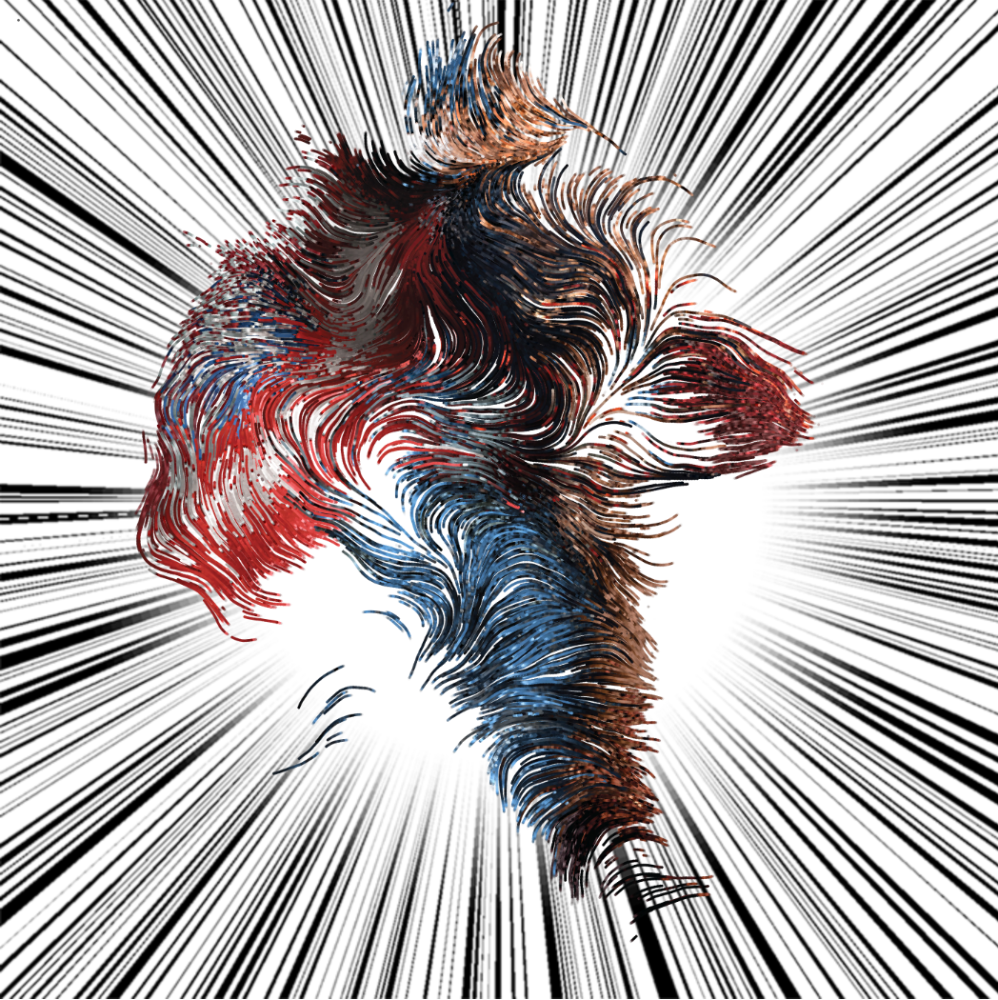
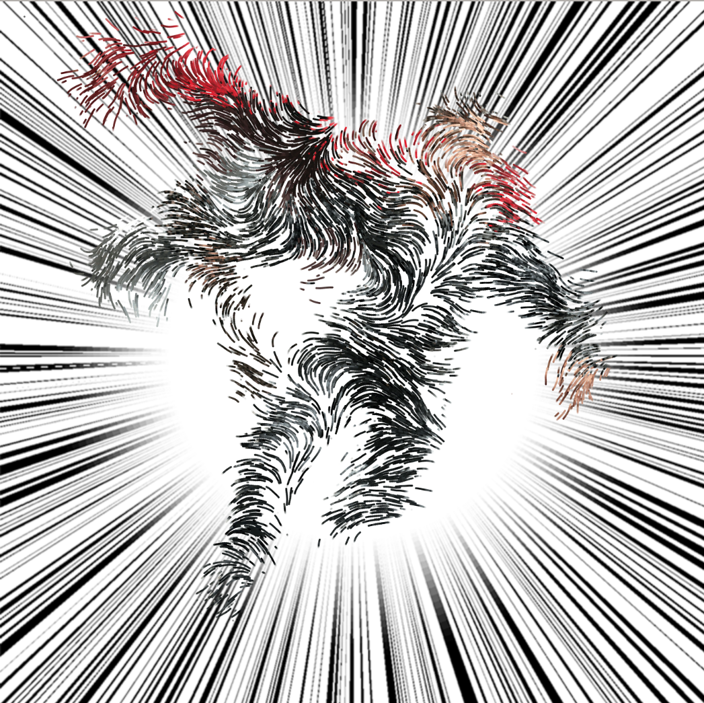
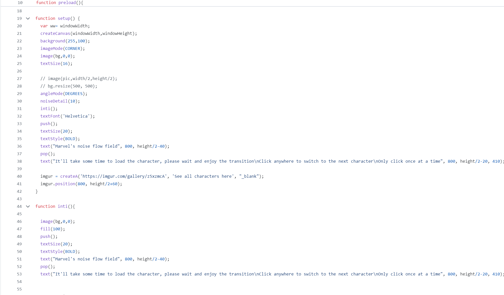

# xliu0051_TUT2_Quiz_8
Quiz 8 Submission
# Stating the imagine inspiration
- **Marvel's Flow Field** by *Summer Chao* from P5.js showcase
    - I found an imaging technique that I’d like to try it in my project, which present a line drawing shapes of complex graphics, and those shapes are able to twist or changing the shape randomly in real time. 
    - 
    - This kind of shape drawing and changing is the effect that I believe suitable for my project, it can create the feeling of moving, let my project has more motion and impact, and the randomness could bring more unexpected changes to audience.
    - 

## The coding technique example
- Code made by *Summer Chao* from P5.js showcase
    - The coding technique it used is similar with the Mona Lisa drawing in week 7. 
    - By placing picture on canvas and generate dots that contains the colour from the picture and using *array* to contain them. Generate them by **for loop** and using **noise()** to let them moving with randomness. 
    - 
    - The coding technique of this example is similar to what we have learnt, therefore it is a good choice to start with. The *array* using and noise function could let the work more organize and creative, createVector function can let the drawing dots moving more controllable and creative as well.
    > Extra info below
    - *Here is a link to the complete code* [Link Text](https://github.com/sssummerchao/Marvel-s-flow-field/blob/main/sketch.js)
    - *Here is a link to the acctual art work* [Link Text](https://showcase.p5js.org/#/2022-All/marvels-flow-field/)